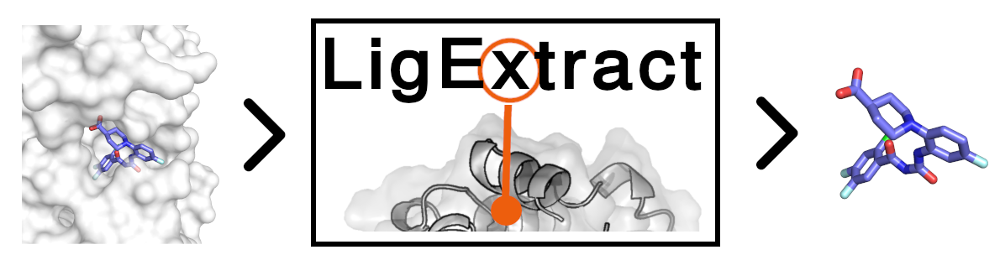
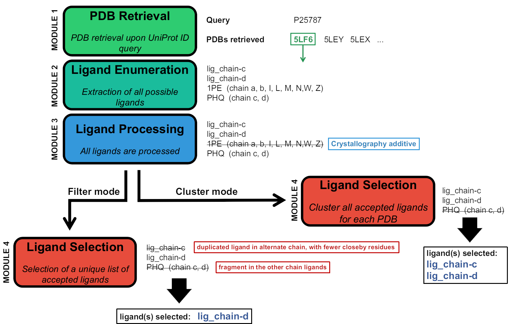

# LigExtract

### Automated Ligand Identification and Extraction from PDB Structures

- **Version: 1.2 (9 July 2026)**

Software that allows large-scale ligand extraction from UniProt ID queries. 

The original publication describing this tool in depth, including performance benchmarks, is [here](https://academic.oup.com/gpb/advance-article/doi/10.1093/gpbjnl/qzaf018/8046017)

Below is the overall workflow of LigExtract:

## Installing LigExtract

**1.** git clone LigExtract into your desired directory:

    git clone https://github.com/comp-medchem/LigExtract.git

**2.** Make scripts inside bin executable:

    chmod 755 path/to/LigExtract/bin/*.sh
        
**3.** Append the following line to the end of your .bashrc file (this will make ligextract runnable from anywhere in your system):

    echo 'export PATH="/path/to/LigExtract/bin:$PATH"' >> ~/.bashrc

**4.** create a ligextract conda environment:

    conda env create -f path/to/LigExtract/ligextract.yml

**5.** Activate the ligextract environment

**6.** Build dependencies (one-off preprocessing step):
        
    build_dependencies.sh

## Running LigExtract

**1.** cd into your working directory. This is where all PDBs will be downloaded and processed. This directory must contain a file with a name following the format 

    <projectname>_uniprot_list.txt

For example, my project is called "myproteins" so the file will be named
        
    myproteins_uniprot_list.txt

This file will contain a list of UniProt IDs (see example in docs)

**2.** Run LigExtract for your query proteins in your *_uniprot_list.txt file, using a maximum resolution value of your choice (e.g. let's consider a cutoff of 2.5). You should use the *cluster* mode (recommended for molecular docking, binding sites study, etc). the following example applies no cleanup (-c no):

    ligextract.sh -d myproteins -r 2.5 -o cluster -c no

In order to consider PDB entries that have no associated resolution (e.g. NMR), instances where resolution is not applicable (resolution is annotated with 'NOT') were assigned the value 10, and instances where resolution would be expected but not reported were assigned the value 11. As a result, if you want to include these cases use **-r 12**, for example.

Alternativelly, you can use clean-up at the end (i.e. removing all raw *.pdb files converted from *.cif), changing to "-c yes".

In this example, ligextract will only consider PDBs up to 2.5 Angstrom resolution and will employ the "cluster" mode (i.e., all ligands that survive filtration are kept, even if duplicated). 
  
  Notice how "myproteins" is the name provided to the -d argument, as this must correspond to the prefix of the *_uniprot_list.txt file.
  

Additionally you can provide your own list of PDBs. This is meant to make the query more efficient in cases where you do not want to consider/process all PDBs that map to your UniProt ID(s). This should be a simple *.txt file with one PDB code per line (not case sensitive).

    ligextract.sh -d myproteins -r 2.5 -f myPdbQueries.txt

You can inspect the arguments available with:

    ligextract.sh -h

*In the example query provided in docs/myproteins_uniprot_list.txt, LigExtract processes 4 protein queries, 265 PDB structures, in around 15 minutes using 14 CPUs.*

## Outputs

#### Cluster mode:

Ligextract produces a table in a file ending with **_ligandsList.txt** with all ligands and some data characterising them, looking like this:

ligandfile | pocketres_chain | pocketres_chain_size | chain_name | ligtype | lig_ID | pdbcode | original_ligID | chainUniprot | chainSize 
--- | --- | --- | --- | --- | --- | --- | --- | --- | ---
8zm6_lig_chain-hA.pdb | ALA113-A;(...);VAL139-A | 20 | A | chain ligand | 8zm6_lig_chain-hA | 8zm6 |  | A(P00800) | A(315)
7ufy_chain-B_lig-N8I-701.pdb | ASN283-B;(...);VAL401-B | 22 | B | small-molecule ligand | N8I-701 | 7ufy | N8I | B(Q9NUW8) | B(460)
9b3b_chain-A_lig-01-701.pdb | ASN203-A;(...);TYR204-A | 24 | A | small-molecule ligand | 01-701 | 9b3b | A1AIM | A(Q9NUW8) | A(460)

In the excerpt shown above (obtained from the example query in myproteins_uniprot_list.txt), we seen three identified ligands:

- the first instance is a di-peptide ligand annotated as part of chain A. Typically, this ligand would be assigned to its own chain, but here it is assigned the same chain as the larger chain A containing the protein query. In order to store this "multi-residue" ligand as a separate entity, the chain code "hA" has been assigned it. Even though the PDB entry 8zm6 has no publication to clarify these two residues are actually a complexed dipeptide, the protein of 8zm6 (Thermolysin) is known to bind to di-peptides. Furthermore, there is no other reason to store these two residues as HETATM if they correspond to the typical structure of the corresponding aminoacids.

- the second instance is a small-molecule ligand with ID N8I (stored under residue number 701). The ligand is connected to chain B.

- the third instance, another small-molecule ligand, has ligand ID A1AIM. However, as this is a long code, it has been replaced with the ID 01. The ligand is stored under residue 701.

The of identified ligands in the output file, and their corresponding cleaned proteins, are stored under **projectname/pdbs_filtered_chains/uniprotQuery/aligned_pdbs**. Here, *projectname* corresponds to the name you provided earlier, and *uniprotQuery* will correspond to each query in your input file. In this directory, a **pymol session file** (*.pse) is also saved with all ligands clustered (each cluster has a color and a code registered in the **clusters** directory).

All structures inside a given uniprot query are aligned and saved separately (ligands and proteins in their own individual files). The **unaligned complexes** are also saved one level up, in **projectname/pdbs_filtered_chains/uniprotQuery**.

The original, raw list of ligands after the first pass (module 1) of ligand identification is saved in **rawlist_extraction.txt**.

There are two types of ligands in LigExtract

- **small molecules**: typically correspond to single-residue ligands. Stored under the name pattern of "_lig-".
- **Chain ligands**: correspond to multi-residue ligands/entities. Stored under the name pattern of "_lig_chain-". Typically (but not always), chain ligands are assigned their own chain ID, separate from the query protein chain(s).

#### Filter mode:
filter model is currently disabled

## Additional Information:
  

#### Arguments of ligextract.sh:
     -h    usage information
     -d    name of the directory that will be created with all PDBs. This will be the prefix for multiple files. (required)
     -r    maximum PDB resolution accepted (default=2.5)
     -o    selected ligand selection mode: can be 'filter' or 'cluster' (default='cluster')
     -c    cleaning outcome: 'yes' will delete cifs directory; 'no' will keep all *.cif files. (default='yes')
     -f    file with a list of PDB IDs to use (optional)
     -v    See installed version

     
#### Usage Notes:

- LigExtract will prompt the user to manually reject or accept each of all experiment method used to obtain the PDBs associated with the UniProt queries.
- LigExtract will replace 5-character ligand codes with a short numerical code (e.g.,A1AIM -> 01) everywhere, through the use of BeEM (mmCIF-to-pdb converter). The user can easily access the original ID in the *-ligand-id-mapping.tsv files for the corresponding PDB, inside cifs.

#### _________

Developed by **Natália Aniceto** (ORCID 0000-0001-7039-0022), **Nuno Martinho** (ORCID 0000-0001-5102-4756) and **Rita Guedes** (ORCID 0000-0002-5790-9181).

If you encounter any errors or issues, or if you have any suggestions, please email Natalia Aniceto at: nataliaaniceto [at]ff.ul.pt
